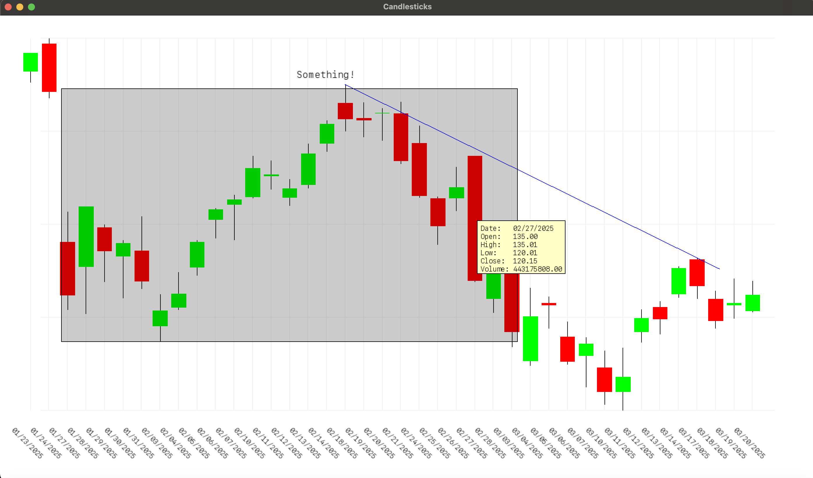

## Depends on

SFML 3

## Keybinds

```
Left Mouse  - Start a line drawing (release to end line)
Right Mouse - Start a rectangle drawing (release to end)
Left Arrow  - Pan left
Right Arrow - Pan right
Scroll      - Zoom in/out

`t`         - Enter text mode (finish with enter)
`f`         - Full view of candlesticks
`d`         - Delete most recent line
`r`         - Delete most recent rectangle
`y`         - Delete most recent text
```

Holding shift while drawing line will lock it horizontally.

## Data

Assumes NASDAQ historical data

